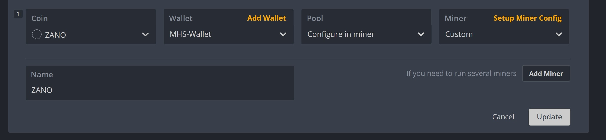
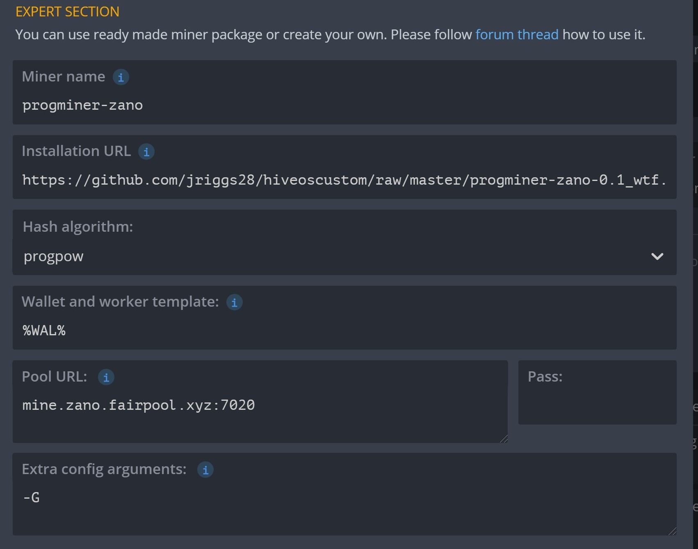

## JRiggs28  HiveOS Progminer-ZANO Custom Miner

** V2 - Custom Miner w/ stats

** V1 - Base Run

This DOES NOT do stats yet but you can start and stop via flight sheet. I plan to get stats going but at least this works.

Feel free to improve on it. 

Big Thanks to:

@ThSupremeLeader  for the fix 

@Clintar - for the base binary

Zano Team - for making Zano :)

*and of course
The Alttank Army*

## How To:

1) Create a flight sheet like this: 

2) SETUP MINER CONFIG

- Miner Name: Dp not change this.

  progminer-zano

- Enter the installation URL: 

  https://github.com/jriggs28/ProgminerHiveOS/raw/master/releases/progminer-zano-2.tar.gz

- Hash Algorithm:

  Doesn’t really matter but I set it to progpow

- Wallet & worker template:

  You can enter %WAL% which takes the wallet info from your hivos config or you can manually enter you wallet in there.  You can also check out if your pool supports worker and put it in there as well.
%WAL%.%WORKER_NAME%

- Pool URL:

  Enter that info with port

- Pass:

  Blank

- Extra Config Arguments:

  I put -G for opencl or you can leave it blank and it picks up defaults.
